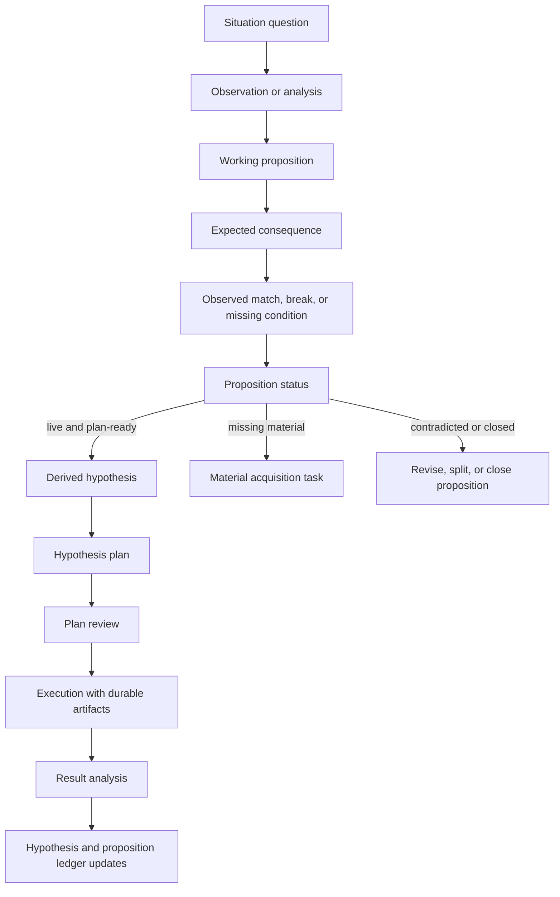

# research-skill

[](https://github.com/komo135/research-skill/actions/workflows/ci.yml)
[](./LICENSE)

`research-skill` is a Claude Code and Codex plugin for **agent-driven R&D**. It gives agents upstream parent-proposition creation, a proposition-first research lifecycle, independent plan review, independent result analysis, and a quantitative research extension for time-series and statistically fragile evaluations.

The central idea is simple: the top-level research unit is a **proposition**, not a standalone plan. Plans test one derived hypothesis traced to a live parent proposition.

## Why this exists

Agentic research often fails in predictable ways: it jumps from vague topics to experiments, treats missing material as permission to speculate, forgets why a hypothesis was generated, or turns a result into a claim without checking whether the original proposition survived.

This plugin makes those transitions explicit:

- create parent propositions from observations and questions before choosing direct solutions;
- collect material before proposing hypotheses;
- record the generated doubt, working proposition, expected consequence, observed match or break, and proposition status;
- derive one plan-ready hypothesis from a live proposition;
- review the plan before execution;
- analyze results before updating hypothesis and proposition ledgers;
- preserve durable artifacts instead of treating stdout as evidence.

## When to use it

Use this plugin when an agent is doing R&D work that needs traceable reasoning, durable evidence, and disciplined claim formation.

Good fits:

- basic research, applied research, or experimental development work;
- exploratory research that must not skip from topic to hypothesis;
- experiments where prior assumptions, comparators, or evaluation method may be wrong;
- post-result analysis where the agent must explain what happened before deciding what to claim;
- quantitative work with time-series validation, multiple-testing risk, leakage risk, or selected-best-of-N evaluation.

Poor fits:

- one-off implementation tasks with no research claim;
- purely qualitative note-taking where no hypothesis, evidence route, or claim is needed;
- work where reproducibility and artifact discipline are intentionally out of scope.

## Skills

| Skill | Role |
|---|---|
| `creating-propositions` | Lens-based upstream skill for creating parent propositions from observations and questions. It turns research material into expectation-break, mechanism, representation, constraint, responsibility, failure, invariant, regime, or measurement propositions before direct-solution prioritization or planning. |
| `research` | Proposition-first protocol for R&D work across Frascati categories. Owns observations, analyses, proposition state, derived hypotheses, plans, claims, decisions, and reports. |
| `research-plan-review` | Independent pre-execution review. Starts from a hypothesis plan path and checks premise, proposition trace, validation method, plan visual, prior-work grounding, and blockers. |
| `research-result-analysis` | Independent post-execution why-analysis. Starts from a hypothesis plan path and explains how the observed result was produced through result shape, factor decomposition, mechanism traces, interactions, and open explanatory branches without writing final claims or decisions. |
| `quant-research` | Domain extension layered on `research` for time-series and statistically rigorous quantitative R&D. Adds validation, leakage, multiple-testing, and robustness guidance. |

## Installation

### Claude Code

```text
/plugin marketplace add https://github.com/komo135/research-skill
/plugin install research@research-skill
```

### Codex

```bash
codex plugin marketplace add https://github.com/komo135/research-skill
```

Enable the plugin in `~/.codex/config.toml`:

```toml
[plugins."research@research-skill"]
enabled = true
```

## Quickstart

This is an agent skill, not a human-operated command-line framework. After installing the plugin, ask your agent to use the skill and give it the research context, material, and desired project location.

Example prompts:

```text
Use the creating-propositions skill to turn these observations into parent propositions.
Do not choose direct solutions or write a plan yet; return observations, questions,
the proposition-generation lens pass, parent propositions, direct-solution
hypothesis slots, expected observations, falsifiers, competing propositions,
and conclusion states.
```

```text
Use the research skill to start a proposition-first R&D project in ./my-research.
The situation question is: why does the baseline fail when preprocessing changes?
Use the attached observations as the initial material. Do not create a hypothesis until
the proposition analysis has enough material.
```

```text
Use research-plan-review on ./my-research/propositions/P001_baseline-break/
hypotheses/H001_discriminator-test/plan.md. Check whether the plan actually tests
the derived hypothesis and whether premise, prior-work grounding, and Plan visual are sufficient.
```

```text
Use research-result-analysis on the completed plan path. Explain why the observed
result happened through result shape, factor decomposition, mechanism traces,
interactions, and open explanatory branches. Do not write final claims,
state-update inputs, proposition decisions, or hypothesis decisions.
```

The agent may use the bundled scripts to create folders, seed ledgers, and check artifacts. Those scripts are implementation utilities for the skill workflow; the normal user interface is the agent conversation.

## Core workflow



Material absence means no proposition or hypothesis. The agent should collect observations, measurements, constraints, comparators, traces, prior-work facts, theoretical tensions, or bottleneck evidence first.

A contradicted proposition is not a plannable parent. Record the contradiction, revise, split, or close the proposition, then derive the next hypothesis under the updated proposition.

## Project layout

The agent creates and maintains this proposition-first structure:

```text
{project-root}/
├── README.md
├── project_state.md
├── decisions.md                         # project-wide decisions only
└── propositions/
    └── P001_slug/
        ├── proposition.md
        ├── observations.md
        ├── analyses.md
        ├── decisions.md                 # proposition decisions
        └── hypotheses/
            └── H001_slug/
                ├── hypothesis.md
                ├── plan.md              # hypothesis plan
                ├── experiments/
                │   ├── code/
                │   ├── configs/
                │   ├── notebooks/
                │   └── runs/
                ├── reports/
                └── decisions.md         # hypothesis decisions
```

`lib/`, `data/`, and `literature/` may exist when the project needs shared code, data, or project-level prior-work state. The lifecycle itself remains organized by propositions and derived hypotheses.

## Research contract

Research-level reproducibility is enforced; experiment-level replicability infrastructure is the agent's discretion.

Reports record material conditions rather than environment locks: data identity, split dates, evaluation protocol, major model/tool versions, hardware class, external API/model version, collection date, formal assumptions, and seed variability when they affect interpretation.

Research scripts still need evidence. Print-only output is incomplete, and stdout is not evidence. Completed runs keep a manifest with `status: completed`, logs, and at least one manifest-listed durable artifact. Claim-to-artifact consistency checks are evidence-integrity checks, not a replacement for methods reproducibility.

## Reports

Reports are paper-grade standalone evidence artifacts under each derived hypothesis. They include Related Work, Theory / Formulation, Methods & Conditions, Results or Observations, Ablation / Sensitivity, Discussion, Limitations, and References.

Sections that do not apply still appear with `Not applicable:` and a reason. Reports should be understandable without replaying the full agent session.

## Hypothesis plans

`propositions/Pxxx_slug/hypotheses/Hxxx_slug/plan.md` contains:

- proposition and hypothesis trace;
- prior-work grounding;
- divergence checkpoint;
- plan visual for architecture, data/evaluation flow, mechanism, system boundary, decision flow, or derivation structure;
- method and evidence route;
- plan review;
- actual execution;
- planned vs actual;
- result analysis;
- claims;
- result feedback.

The trace must include Situation question context, Generated doubt, Working proposition, Expected consequence, Proposition status, Derived hypothesis, and Hypothesis plan link. The plan may summarize proposition history but must not rewrite it.

Prior-work grounding uses `literature/{papers.md,positioning.md}` when project-level prior-work state is useful.

Mid-execution literature update is required when an unfamiliar method, unexpected result, new comparator, contradiction with prior work, or missing-baseline signal appears before claim-bearing execution continues.

## Quant research extension

`quant-research` adds statistical methodology for time-series and selected-best evaluations. Use it together with `research` when:

- time order matters and random-shuffle CV would leak future information;
- labels overlap and ordinary k-fold validation underestimates error;
- many variants are tested and the best one is selected;
- feature construction may use information unavailable at prediction time;
- a result needs robustness checks across regimes, perturbations, or parameter settings.

The extension includes references for validation, feature construction, model diagnostics, prediction-to-decision mapping, multiple testing, robustness, and sanity checks. It also includes utility scripts for purged k-fold, CPCV, walk-forward validation, leakage checks, multiple-testing corrections, sanity checks, and sensitivity grids.

## Agent-facing utilities

The repository includes small Python utilities that agents can use to make the workflow repeatable. They are not the primary user interface, and they should not replace the skill's judgment about material sufficiency, proposition status, plan readiness, or claim scope.

`skills/research/scripts/`:

| Script | Purpose |
|---|---|
| `new_project.py` | Initialize proposition-first project structure. |
| `new_proposition.py` | Create `propositions/Pxxx_slug/` with proposition, observations, analyses, decisions, and hypotheses directory. |
| `new_hypothesis.py` | Create `hypotheses/Hxxx_slug/` with hypothesis ledger, hypothesis plan, experiments, reports, and decisions. |
| `new_run.py` | Create durable run evidence scaffold under a derived hypothesis. |
| `check_run_artifacts.py` | Reject print-only runs and verify manifest/logs/non-log artifacts. |
| `check_mechanism_hypothesis_record.py` | Legacy checker for older mechanism-record plans; current flow uses proposition analyses and hypothesis ledgers. |
| `check_claims.py` | Verify claim record structure. |
| `check_report.py` | Verify report contract. |
| `draft_report.py` | Initialize a report under a derived hypothesis. |

`skills/quant-research/scripts/`:

| Script | Purpose |
|---|---|
| `purged_kfold.py` | Purged k-fold cross-validation for time-series with overlapping labels. |
| `cpcv.py` | Combinatorial Purged Cross-Validation. |
| `walk_forward.py` | Walk-forward validation with expanding or rolling windows. |
| `multiple_testing.py` | Multiple-testing corrections, including Bonferroni, Benjamini-Hochberg, and Romano-Wolf. |
| `leakage_check.py` | Detect train/test feature leakage and look-ahead bias. |
| `sanity_checks.py` | Standard pre-claim sanity checks. |
| `sensitivity_grid.py` | Parameter sensitivity grid for robustness analysis. |

There is no standalone `new_plan.py`; top-level plans are the old lifecycle.

## Development

Install development dependencies:

```bash
python -m pip install -r requirements-dev.txt
```

Run checks:

```bash
python -m pytest
python -m json.tool .codex-plugin/plugin.json
python -m json.tool .claude-plugin/plugin.json
python -m json.tool .claude-plugin/marketplace.json
git diff --check
```

Before adding or changing tests, apply the repository's Test Admission Gate in `AGENTS.md`. For release, packaging, cache, and plugin metadata work, use verification commands and report evidence instead of adding version-number or release-state tests.

## Contributing

Contributions are welcome when they preserve the proposition-first lifecycle and keep public contracts explicit. Start with [CONTRIBUTING.md](./CONTRIBUTING.md), and use the issue and pull request templates in `.github/`.

For security or safety-sensitive reports, see [SECURITY.md](./SECURITY.md).

## License

MIT. See [LICENSE](./LICENSE).
