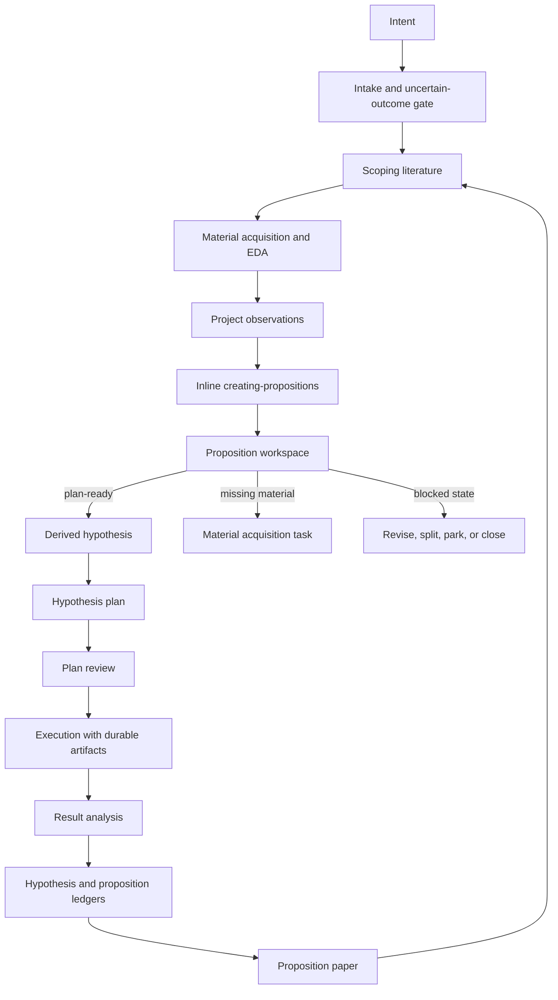

# research-skill

[](https://github.com/komo135/research-skill/actions/workflows/ci.yml)
[](./LICENSE)

`research-skill` is a Claude Code and Codex plugin for **agent-driven R&D**. It gives agents intent intake, scoping literature, material/EDA, proposition workspace management, a proposition-first hypothesis lifecycle, independent plan review, root-cause-oriented result analysis, proposition-level research papers, and a quantitative research extension for time-series and statistically fragile evaluations.

The central idea is simple: the top-level research unit is a **proposition**, not a standalone plan. Plans test one derived hypothesis traced to a live parent proposition.

## Why this exists

Agentic research often fails in predictable ways: it jumps from vague topics to experiments, treats missing material as permission to speculate, forgets why a hypothesis was generated, or turns a result into a claim without checking whether the original proposition survived.

This plugin makes those transitions explicit:

- classify intent with an uncertain-outcome gate before opening research state;
- use scoping literature, material acquisition, and EDA before proposition creation;
- create and manage proposition workspaces before choosing direct solutions;
- record the generated doubt, working proposition, expected consequence, observed match or break, and proposition status;
- derive one plan-ready hypothesis from a live proposition;
- review the plan before execution;
- analyze results before updating hypothesis and proposition ledgers;
- preserve durable artifacts instead of treating stdout as evidence.

## When to use it

Use this plugin when an agent is doing R&D work that needs traceable reasoning, durable evidence, and disciplined claim formation.

Good fits:

- basic research, applied research, or experimental development work;
- exploratory research that must not skip from topic to hypothesis;
- experiments where prior assumptions, comparators, or evaluation method may be wrong;
- post-result analysis where the agent must explain what happened, including why predictions missed, before deciding what to claim;
- quantitative work with time-series validation, multiple-testing risk, leakage risk, or selected-best-of-N evaluation.

Poor fits:

- one-off implementation tasks with no research claim;
- purely qualitative note-taking where no hypothesis, evidence route, or claim is needed;
- work where reproducibility and artifact discipline are intentionally out of scope.

## Skills

| Skill | Role |
|---|---|
| `creating-propositions` | Proposition workspace owner. It turns research material into Surprise/Bit/Flip propositions, creates and manages `propositions/Pxxx_slug/{proposition,observations,analyses,decisions}.md`, and owns the 9-state proposition vocabulary before direct-solution prioritization or planning. |
| `research` | Workflow orchestrator for R&D work across Frascati categories. Owns intake, scoping literature, material/EDA, project observations, derived hypotheses, plans, claims, evidence, decisions, proposition-level papers, and research cycles. |
| `research-plan-review` | Independent pre-execution review. Starts from a hypothesis plan path and checks premise, proposition trace, validation method, plan visual, prior-work grounding, and blockers. |
| `research-result-analysis` | Independent post-execution why-analysis. Starts from a hypothesis plan path and explains how the observed result was produced through result shape, causal factor decomposition, root-cause candidates, mechanism traces, interactions, discriminators, and open explanatory branches without writing final claims or decisions. |
| `quant-research` | Domain extension layered on `research` for time-series and statistically rigorous quantitative R&D. Adds validation, leakage, multiple-testing, and robustness guidance. |

## Installation

### Claude Code

```text
/plugin marketplace add https://github.com/komo135/research-skill
/plugin install research@research-skill
```

### Codex

```bash
codex plugin marketplace add https://github.com/komo135/research-skill
```

Enable the plugin in `~/.codex/config.toml`:

```toml
[plugins."research@research-skill"]
enabled = true
```

## Quickstart

This is an agent skill, not a human-operated command-line framework. After installing the plugin, ask your agent to use the skill and give it the research context, material, and desired project location.

Example prompts:

```text
Use the creating-propositions skill to turn these observations into parent propositions.
Do not choose direct solutions or write a plan yet; return observations, questions,
the proposition-generation lens pass, parent propositions, direct-solution
hypothesis slots, expected observations, falsifiers, competing propositions,
and conclusion states.
```

```text
Use the research skill to start a proposition-first R&D project in ./my-research.
The intent is: why does the baseline fail when preprocessing changes?
Use intake, scoping, EDA/material acquisition, and project observations before opening
a proposition. Do not create a hypothesis until the proposition analysis has enough material.
```

```text
Use research-plan-review on ./my-research/propositions/P001_baseline-break/
hypotheses/H001_discriminator-test/plan.md. Check whether the plan actually tests
the derived hypothesis and whether premise, prior-work grounding, and Plan visual are sufficient.
```

```text
Use research-result-analysis on the completed plan path. Explain why the observed
result happened through result shape, causal factor decomposition, root-cause
candidates, mechanism traces, interactions, discriminators, and open explanatory
branches. Do not write final claims, state-update inputs, proposition decisions,
or hypothesis decisions.
```

The agent may use the bundled scripts to create folders, seed ledgers, and check artifacts. Those scripts are implementation utilities for the skill workflow; the normal user interface is the agent conversation.

## Core workflow



Material absence means no proposition or hypothesis. The agent should collect observations, measurements, constraints, comparators, traces, prior-work facts, theoretical tensions, or bottleneck evidence first.

A contradicted, under-specified, split-needed, split, parked, or closed proposition is not a plannable parent. Record the transition, revise, split, unpark, reopen with reason, or close before deriving the next hypothesis.

## Project layout

The agent creates and maintains this proposition-first structure:

```text
{project-root}/
├── intake.md
├── literature/
│   ├── scoping.md
│   ├── papers.md
│   └── positioning.md
├── data/
│   ├── raw/
│   ├── processed/
│   └── eda/
├── observations.md
├── status_brief.md                    # interim stakeholder brief, not paper
├── README.md
├── project_state.md
├── decisions.md                         # project-wide decisions only
├── lib/{data,eval,viz,utils,tests}/
└── propositions/
    └── P001_slug/
        ├── proposition.md
        ├── observations.md
        ├── analyses.md
        ├── decisions.md                 # proposition decisions
        ├── paper.md                      # proposition-level paper
        └── hypotheses/
            └── H001_slug/
                ├── hypothesis.md
                ├── plan.md              # hypothesis plan
                ├── experiments/
                │   ├── code/
                │   ├── configs/
                │   ├── notebooks/
                │   └── runs/
                └── decisions.md         # hypothesis decisions
```

This layout is canonical. Use root `status_brief.md` for interim stakeholder notes before proposition resolution. Do not use top-level `plans/`, top-level `experiments/<id>/runs/`, `literature/differentiation.md`, per-hypothesis report directories, or provisional `paper.md` drafts.

## Research contract

Research-level reproducibility is enforced; experiment-level replicability infrastructure is the agent's discretion.

Papers and plans record material conditions rather than environment locks: data identity, split dates, evaluation protocol, major model/tool versions, hardware class, external API/model version, collection date, formal assumptions, and seed variability when they affect interpretation.

Research scripts still need evidence. Print-only output is incomplete, and stdout is not evidence. Completed runs keep a manifest with `status: completed`, logs, and at least one manifest-listed durable artifact. Claim-to-artifact consistency checks are evidence-integrity checks, not a replacement for methods reproducibility.

## Research papers

Research papers are paper-grade proposition-level synthesis artifacts at `propositions/Pxxx_slug/paper.md`, created only when a proposition reaches `supported` or `contradicted`. They are not stakeholder briefs, meeting memos, or provisional wrappers around one positive result. They include Related Work, Theory / Formulation, Methods & Conditions, Results or Observations, Ablation / Sensitivity, Claim-to-result alignment, Discussion, Limitations, Reproducibility, and References.

Sections that do not apply still appear with `Not applicable:` and a reason. Papers should be understandable without replaying the full agent session and become material for the next research cycle.

## Hypothesis plans

`propositions/Pxxx_slug/hypotheses/Hxxx_slug/plan.md` contains:

- proposition and hypothesis trace;
- prior-work grounding;
- divergence checkpoint;
- plan visual for architecture, data/evaluation flow, mechanism, system boundary, decision flow, or derivation structure;
- method and evidence route;
- plan review;
- actual execution;
- planned vs actual;
- result analysis;
- claims;
- result feedback.

The trace must include Situation question context, Generated doubt, Working proposition, Expected consequence, Proposition status, Derived hypothesis, and Hypothesis plan link. The plan may summarize proposition history but must not rewrite it.

Prior-work grounding uses `literature/{papers.md,positioning.md}` when project-level prior-work state is useful. It does not replace the scoping scan in `literature/scoping.md`, and scoping does not replace plan-scoped Survey evidence and Citation-use map.

Mid-execution literature update is required when an unfamiliar method, unexpected result, new comparator, contradiction with prior work, or missing-baseline signal appears before claim-bearing execution continues.

## Quant research extension

`quant-research` adds statistical methodology for time-series and selected-best evaluations. Use it together with `research` when:

- time order matters and random-shuffle CV would leak future information;
- labels overlap and ordinary k-fold validation underestimates error;
- many variants are tested and the best one is selected;
- feature construction may use information unavailable at prediction time;
- a result needs robustness checks across regimes, perturbations, or parameter settings.

The extension includes references for validation, feature construction, model diagnostics, prediction-to-decision mapping, multiple testing, robustness, and sanity checks. It also includes utility scripts for purged k-fold, CPCV, walk-forward validation, leakage checks, multiple-testing corrections, sanity checks, and sensitivity grids.

## Agent-facing utilities

The repository includes small Python utilities that agents can use to make the workflow repeatable. They are not the primary user interface, and they should not replace the skill's judgment about material sufficiency, proposition status, plan readiness, or claim scope.

`skills/research/scripts/`:

| Script | Purpose |
|---|---|
| `new_project.py` | Initialize the canonical project structure with intake, scoping literature, data/EDA, observations, lib, and propositions. |
| `creating-propositions/scripts/new_proposition.py` | Create `propositions/Pxxx_slug/` with proposition, observations, analyses, decisions, and hypotheses directory. |
| `new_hypothesis.py` | Create `hypotheses/Hxxx_slug/` with hypothesis ledger, hypothesis plan, experiments, and decisions. |
| `new_run.py` | Create durable run evidence scaffold under a derived hypothesis. |
| `check_run_artifacts.py` | Reject print-only runs and verify manifest/logs/non-log artifacts. |
| `check_mechanism_hypothesis_record.py` | Legacy checker for older mechanism-record plans; current flow uses proposition analyses and hypothesis ledgers. |
| `check_claims.py` | Verify claim record structure. |
| `check_paper.py` | Verify proposition-level paper structure and old-path rejection. |
| `draft_paper.py` | Initialize `propositions/Pxxx_slug/paper.md`. |

`skills/quant-research/scripts/`:

| Script | Purpose |
|---|---|
| `purged_kfold.py` | Purged k-fold cross-validation for time-series with overlapping labels. |
| `cpcv.py` | Combinatorial Purged Cross-Validation. |
| `walk_forward.py` | Walk-forward validation with expanding or rolling windows. |
| `multiple_testing.py` | Multiple-testing corrections, including Bonferroni, Benjamini-Hochberg, and Romano-Wolf. |
| `leakage_check.py` | Detect train/test feature leakage and look-ahead bias. |
| `sanity_checks.py` | Standard pre-claim sanity checks. |
| `sensitivity_grid.py` | Parameter sensitivity grid for robustness analysis. |

There is no standalone `new_plan.py`; top-level plans are the old lifecycle.

## Development

Install development dependencies:

```bash
python -m pip install -r requirements-dev.txt
```

Run checks:

```bash
python -m pytest
python -m json.tool .codex-plugin/plugin.json
python -m json.tool .claude-plugin/plugin.json
python -m json.tool .claude-plugin/marketplace.json
git diff --check
```

Before adding or changing tests, apply the repository's Test Admission Gate in `AGENTS.md`. For release, packaging, cache, and plugin metadata work, use verification commands and report evidence instead of adding version-number or release-state tests.

## Contributing

Contributions are welcome when they preserve the proposition-first lifecycle and keep public contracts explicit. Start with [CONTRIBUTING.md](./CONTRIBUTING.md), and use the issue and pull request templates in `.github/`.

For security or safety-sensitive reports, see [SECURITY.md](./SECURITY.md).

## License

MIT. See [LICENSE](./LICENSE).
